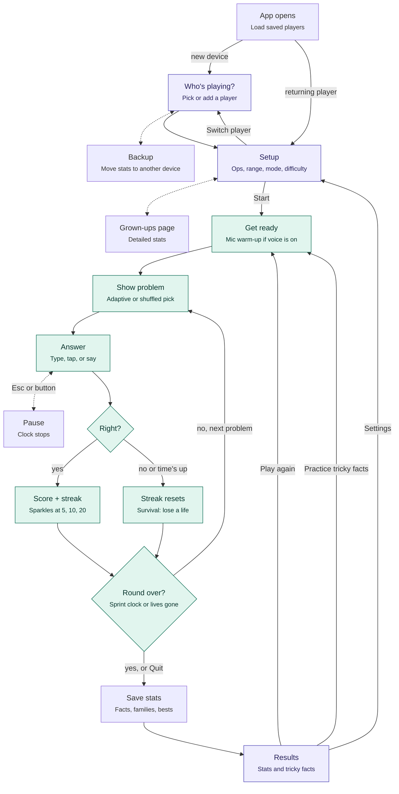

# Number Zoomies — program flow

How the game moves from screen to screen, and how a round loops through problems.
Purple boxes are screens the player sees. Teal boxes are the round loop.

## Notes

- **Get ready** locks input until the microphone is in hand, so a permission prompt never eats into the round.
- **Show problem** uses the adaptive picker (tricky facts and weak fact families) at the rate set in Setup; otherwise it draws from a shuffled bag of every fact in range. Drill rounds use only the chosen facts or family.
- In **Survival**, each problem's clock shrinks as the score climbs, tapering toward the difficulty's floor. In **Sprint**, one clock runs for the whole round.
- **Save stats** keeps typed, picked and spoken answer times in separate books, so voice lag and multiple-choice guesses don't skew typed speed.
